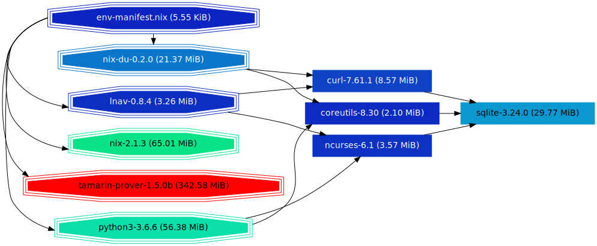
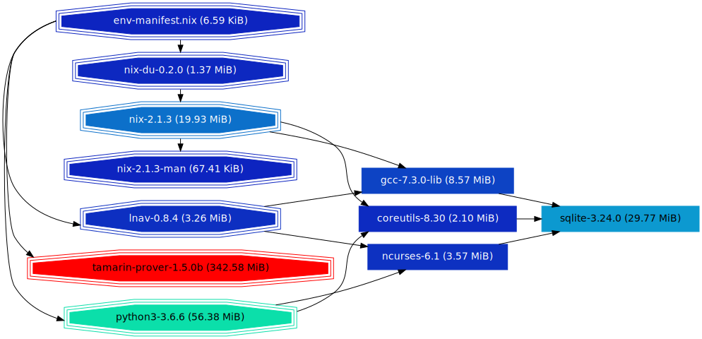

# nix-du
`nix-du` is a tool aimed at helping answer the following question:

What gc-roots should I remove in my nix store to free some space ?
What packages should I remove from my profile to free some space ?

## Getting started
### Installation
`nix-du` is available in `nixpkgs >= 18.09-pre`, see the badge below.

[](https://repology.org/metapackage/nix-du)

Installation in this case is straightforward.
```
nix-env -f <nixpkgs> -iA nix-du
```

For alternative installation methods, see [INSTALL.md](./INSTALL.md).

### Running

`nix-du` outputs its analysis as a directed graph (more on that later) in the DOT format.
Therefore you need `dot` installed (it is usually available under the package name `graphviz`).
Then you can translate the graph in various more "traditional" image formats.

For example:
```sh
# to svg
nix-du -s=500MB | tred | dot -Tsvg > store.svg
# to png
nix-du -s=500MB | tred | dot -Tpng > store.png
```
Another option is to use an interactive viewer such as `zgrviewer`
```sh
nix-du -s=500MB | tred > store.dot
zgrviewer store.dot
```

Piping `nix-du`'s output through `tred` as above simplifies the graph and is highly recommended,
although not mandatory.

### Interpreting the result
#### What gc-roots are taking space ?
As an example, imagine the following scenario.
You start with a brand new, empty installation of nix. You install
`nix-index`. Then you run `nix-du`:
```
nix-du | tred | dot -Tsvg > result.svg
```


On the left are the gc-roots. The other nodes are labeled with a package name,
but it has little meaning. What matters is their size. Blue means "lightest";
red means "heaviest".  An edge from A to B means "you won't be able to remove B
as long as A is alive". If you remove all incoming edges of a node, it _should_
go away when you run `nix-collect-garbage` and this _should_ free approximately
the displayed amount of space.

In this instance, we see that `root` and `coucou` share the same channel, which
weighs about 50Mo.  The arrows from the channels to `user-environment`
symbolize that if you want to get rid of these 50MB you have to delete both the
channels of `root` and `coucou`.

`nix-index` on the other hand does not appear in the graph: if you remove your (only)
profile (in yellow) then `nix-index` will be gone. The node `nix-index` has thus been
merged with the node of the profile. To sum up, if you remove your profile, you will
save around 27MB.

Now, you install `graphviz`.


If you remove your second profile, you spare all of `graphviz` and its dependencies (140 MB)
but if you remove your first profile, you don't save any space: `nix-index` is a dependency
of both your profiles, and has thus its own node now.

If you remove `graphviz` with `nix-env -e graphviz`


... you realize that it is still in your second profile.
So if you want to save space, remove the red node :)

#### Filters
In the reality, the dependency graph of a store is often very big (and `dot` will
struggle computing a layout for it) so you can ask `nix-du` to simplify it:
* only keep nodes weighing at least 500 MB (i.e. i am only interested in saving at least 500 MB):
```
nix-du -s=500MB | tred | dot -Tsvg > store.svg
```
* only keep the 50 heaviest inner nodes
```
nix-du -n=50 | tred | dot -Tsvg > store.svg
```
Note that with `-n` some roots are kept even if they are not heavy enough.

With both filtering methods, the size of nodes becomes an approximation, so don't
be surprised if removing a 500MB root only saves 450MB.

### What element of my profile is taking space ?
`nix-du` can also be used for example to analyse which dependencies of a store
path are responsible for disk usage. To do so, pass `--root
/nix/store/hash-foo`. Notably, here are useful use cases:

* Which packages installed with `environment.systemPackages` in `/etc/nixos/configuration.nix` use most space ?
```
nix-du --root /run/current-system/sw/ -s 500MB | tred > result.dot
```
* Which packages installed with `nix-env` use most space ? (ignoring everything less than 500MB)
```
nix-du --root ~/.nix-profile | tred > result.dot
```
##### Example



The octogonal boxes are the children of the root store path (here elements of my
profile).

You can see for example that nix has no dependencies in the graph: it was likely
installed from another `nixpkgs` commit than the rest of the profile and thus does
not share its dependencies with them. Let's remedy this situation:

```
nix-env -f "<nixpkgs>" -iA nix
```



Now, nix weighs less (because it shares its dependencies with the rest of my profile)
and you see that `nix-du` only weighs a few megabytes if you don't count that it
depends on nix.

## Caveats
### `--root` and external referrers
Note that when passed `--root`, `nix-du` will ignore everything not in the
transitive closure of the specified store path. This can lead to surprising behavior.
Example: if you have such a NixOS configuration:
```nix
{ pkgs, config, ... }:
{
  services.openssh.enable = true;
  environment.systemPackages = with pkgs; [ openssh ];
}
```
Then you run
```
nix-du --root /run/current-system/sw/ | tred > result.dot
```
and see that `openssh` accounts for 123 MB of space. Then you remove `openssh` from
your `systemPackages`, delete the old generation, and don't free 123 MB. This is
because something else (here the unit file `sshd.service`) also depends on `openssh`,
preventing its removal, but was completely ignored by `nix-du`.

### Store optimisation
If you use store optimisation (see the documentation of `nix-store --optimise`) then
identical files in unrelated store paths are deduplicated and replaced by a hard link
to save space. To report accurate sizes, `nix-du` needs to scan your whole store
for deduplicated files, which takes quite a long time (especially on rotating drives).
(This is also the reason why `nix-collect-garbage` takes so long, by the way).

Therefore, by default, `nix-du` will only look for deduplicated files among
live paths (option `-O1`). You can get a fully precise report with `-O2` or opt
out deduplicated files detection with `-O0`. In the last case, a deduplicated
file will be counted twice if it appears in two store paths, and sizes will be
over estimated.

## FAQ
### What is _really_ this graph ?
If you use neither `-s` nor `-n` then the output graph is derived from the reference graph of your store as followed
* the set of nodes is the quotient of the original node set by the relation "these two nodes are (recursively) referenced
by the same set of gc-roots"
* There is an edge between two classes if it is not a self loop and there was an edge between any elements of the classes
in the original graph

The representative of the class inherits the total size of the class and the name of an arbitrary member.
This is sometimes useful, but also often meaningless. For example I have already seen a huge node `glibc-locales` with
an edge to `texlive` components which is surprising since `glibc-locales` has no references...

If you use any of `-s` (only keep nodes bigger than a given size) or `-n` (only keep the `n` biggest nodes) then an approximation
is done so results may be less accurate (but far more readable !)

### My store weighs more than the total size of the graph
Only live paths are displayed. Or see the section about optimisation.

### My store is far lighter than displayed!
This has probably to do with store optimisation. See the relevant section.
Or if you use `--root`, only the transitive closure of the root is displayed.

### I removed a huge node and yet `nix-collect-garbage` freed only little space!
Without `--root` this probably has to do with optimisation. See the relevant section.
With `--root` it can happen that the node you removed had a referrer outside of the
transitive closure of the root. See an example above in the section about `--root`.

### I asked for 60 nodes with `-n 60` but I got 120!
When you apply a filter with `-n` or `-s` all roots which have a (transitive) child kept by the filter are kept as well.
Remaining roots are merged in the `{filtered out}` node.

### What is the `{transient}` node ?

This is a node coalescing all memory and temporary roots, in nix parlance. A
memory root represents a process which has mmap-ed a store path, and a transient root
is a root crated by the nix build machinery to the dependencies of a currently
running build.  TL;DR: this node denotes live stuff depending on the store but
which will disappear after a reboot.
