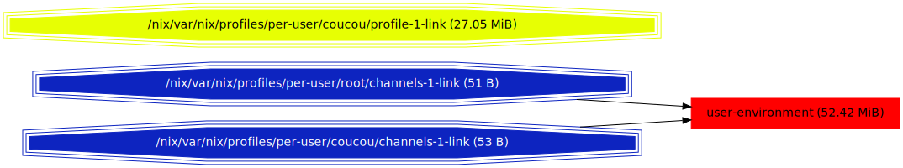
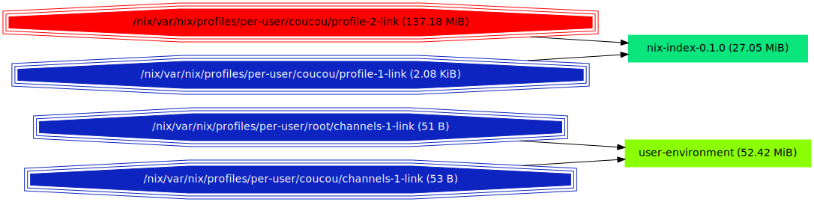
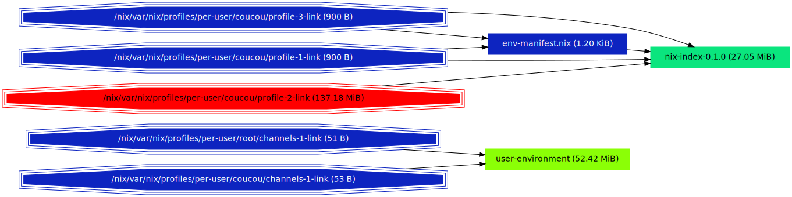

# nix-du
`nix-du` is a tool aimed at helping answer the following question:

What gc-roots should I remove in my nix store to free some space ?

## Getting started
### Building
#### With `nix`
```
$ nix-env -if https://github.com/symphorien/nix-du/archive/master.tar.gz
```
For NixOS 17.09 users, use a more recent `nixpkgs`:
```
$ nix-env -I nixpkgs=https://nixos.org/channels/nixos-unstable/nixexprs.tar.xz -if https://github.com/symphorien/nix-du/archive/master.tar.gz
```
#### With `cargo`
Just run `cargo build --release` at the root of the repository.
One of the dependencies at least requires rust `>=1.20`.

You need `nix` version 2 and `boost` (a dependency of `nix`).
Tests need `dot` in `$PATH`.

Note that `nix` 2 is only needed to build `nix-du`; `nix-du` should be able to talk to a
`nix` 1 daemon.

### Running
`nix-du` generates a directed graph (more on that later) in the DOT format.
Therefore you need `dot` installed (it is usually available under the package name `graphviz`).
Then you can translate the graph in various more "traditional" image formats.

For example:
```sh
# to svg
nix-du -s=500MB | tred | dot -Tsvg > store.svg
# to png
nix-du -s=500MB | tred | dot -Tpng > store.png
```
Another option is to use an interactive viewer such as `zgrviewer`
```sh
nix-du -s=500MB | tred > store.dot
zgrviewer store.dot
```

Piping `nix-du`'s output through `tred` as above simplifies the graph and is highly recommended,
although not mandatory.

### Interpreting
On the left are the gc-roots. The other nodes are labeled with a package name, but it has little meaning. What
matters is their size. Blue means "lightest"; red means "heaviest".
An edge from A to B means "you won't be able to remove B as long as A is alive". If you remove all
incoming edges of a node, it _should_ go away when you run `nix-collect-garbage` and this _should_ free approximately
the displayed amount of space.


An example is often better than an abstract explanation so let's imagine a scenario.
You start with a brand new, empty installation of nix. You install `nix-index`. The
result, as returned by `nix-du`, is the following.



Here we see that `root` and `coucou` share the same channel, which weighs about 50Mo.
The arrows from the channels to `user-environment` symbolize that if you want to get
rid of these 50MB you have to delete both the channels of `root` and `coucou`.

`nix-index` on the other hand does not appear in the graph: if you remove your (only)
profile (in yellow) then `nix-index` will be gone. The node `nix-index` has thus been
merged with the node of the profile. To sum up, if you remove your profile, you will 
save around 27MB.

Now, you install `graphviz`.



If you remove your second profile, you spare all of `graphviz` and its dependencies (140 MB)
but if you remove your first profile, you don't save any space: `nix-index` is a dependency
of both your profiles, and has thus its own node now.

If you remove `graphviz` with `nix-env -e graphviz`



... you realize that it is still in your second profile.
So if you want to save space, remove the red node :)


## FAQ
### What is _really_ this graph ?
If you use neither `-s` nor `-n` then the output graph is derived from the reference graph of your store as followed
* the set of nodes is the quotient of the original node set by the relation "these two nodes are (recursively) referenced
by the same set of gc-roots"
* There is an edge between two classes if it is not a self loop and there was an edge between any elements of the classes
in the original graph

The representent of the class inherits the total size of the class and the name of an arbitrary member.
This is sometimes useful, but also often meaningless. For example I have already seen a huge node `glibc-locales` with 
an edge to texlive components which is surprising since `glibc-locales` has no references...

If you use any of `-s` (only keep nodes bigger than a given size) or `-n` (only keep the `n` biggest nodes) then an approximation
is done so results may be less accurate (but far more readable !)

### But my store is far havier than displayed!
Only live paths are displayed.

### I asked for 60 nodes with `-n 60` but I got 120!
When you apply a filter with `-n` or `-s` all roots which have a (transitive) child kept by the filter are kept as well.
Remaining roots are merged in the `{filtered out}` node.

### I removed a huge node and yet `nix-collect-garbage` freed only little space
For now `nix-du` does not take hard linked files (see `nix-store --optimise`) into account which means that if they belong
to 3 derivations they will be counted 3 times.

## Limitations
* no optimised store support
* may use more testing :)
